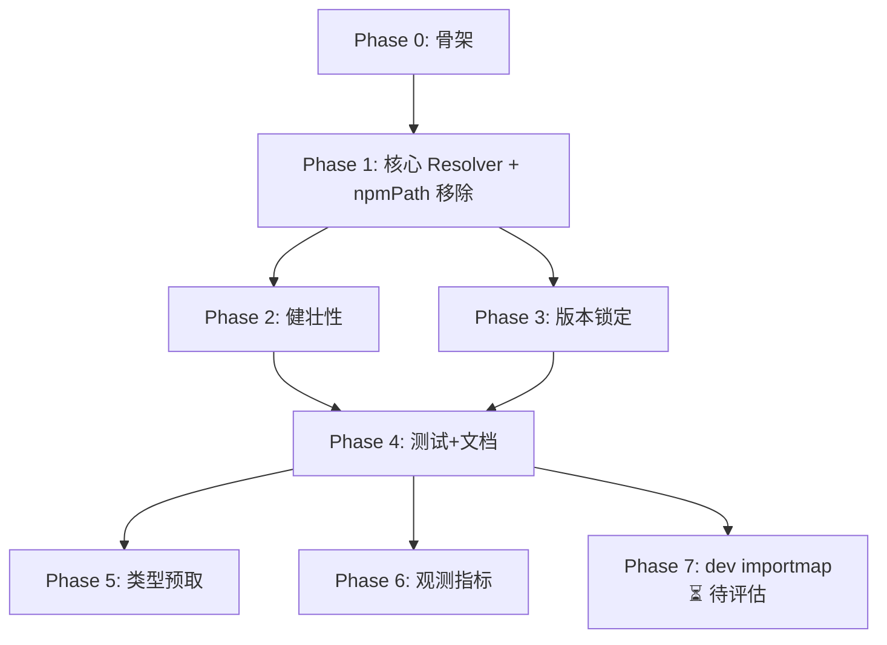

<!--
SPDX-FileCopyrightText: 2026-present Brian Wang <wangbuke@gmail.com>
SPDX-License-Identifier: LGPL-3.0-or-later
-->

# Choysum ESM 依赖解析与全局缓存架构设计（实施基线版）

更新时间：2026-06-17

文档状态：设计冻结有效，实施归零（所有代码实现已随分支重置清除，待重新实施）

状态说明：

1. 本文档从"设计评审清单版"升级为"实施基线版"，设计方向冻结不变。
2. 截至 2026-06-17，`git reset --hard HEAD` 后当前 main 分支代码中 **无任何 ESM 实现代码**（无 `esmfetcher`、`esmresolver`、`choysum-esm` plugin、`esm_*` 配置项）。
3. npmPath 迁移目标仍为硬切（无兼容窗口），当前实现完成度为零——`pkg/config/config.go` 仍声明 `NpmPath` / `npm_path`，且全命令链仍透传 `npmPath`。
4. 本次校准后，所有 Phase 状态重置为"未开始"，Must/Should/Could 清单重置为待办。重新实施将从 Phase 0 起步。

## 1. 文档目的

本文是 Choysum 从“构建依赖 node_modules”向“构建期 ESM 解析 + 全局缓存”迁移的主设计文档，覆盖：

1. 现状评估（基于当前代码结构）。
2. 目标架构与边界。
3. 设计评审清单（Must / Should / Could）。
4. 分阶段实施与验收条目。

不覆盖范围：

1. modules-directory 目录治理与发布流程。
2. npm catalog/index 语义定义（沿用现有方案）。
3. 对外 CLI 产品文案与市场发布节奏。

## 2. 代码现状评估（结论）

当前设计方向总体合理，且具备落地基础，但仍需补齐关键收口点。

### 2.1 已具备的基础能力

1. 构建链统一走 esbuild，且 plugin 注入路径清晰：backend/web 都可扩展。
2. 后端构建是“先 bundle 再执行”，适合在构建期拦截裸导入，无需在 QuickJS 运行时二次加载远程模块。
3. 现有 registry 下载链已有 HTTP 拉取、tarball 解包、安全路径检查能力，可复用下载基础设施。
4. 现有 staging 与原子写机制可用于缓存落盘与一致性控制。

### 2.2 当前缺口（必须先收口）

1. Web 构建仍显式依赖 node_modules（NodePaths）。
2. Backend/Web 插件尚无通用裸导入 OnResolve 拦截器。
3. CLI/runtime 仍将 npmPath 视为必填，迁移会受阻。
4. peerDependencies 虽已解析，但未进入统一的“构建期依赖解析输入面”。
5. 当前下载链虽拿到 integrity 字段，但缺少下载内容强校验闭环。
6. 前端若采用 inline importmap，会与生产 CSP 策略冲突。
7. 测试链（Vitest/Playwright）仍强依赖 Node 工具链，需与运行时“去 Node”目标解耦定义。

## 3. 目标架构（冻结版）

## 3.1 总体原则

1. 依赖解析发生在“构建期”而非 QuickJS 运行期。
2. 统一支持裸导入（bare imports）。
3. 统一引入全局缓存目录（默认在 DefaultChoysumPath 下）。
4. 构建稳定性优先于“完全在线实时拉取”。
5. 可观测、可回滚、可灰度。

## 3.2 统一 ESM Resolver

在 esbuild 插件层新增通用 resolver（命名：choysum-esm-resolver）：

1. OnResolve：拦截 bare imports，映射到受控 ESM 源 URL（默认 esm.sh）。
2. OnLoad：先读全局缓存，未命中则下载并落盘后返回内容。
3. 递归依赖交给 esbuild 依赖图继续触发 resolve/load。
4. Backend/Web 共享同一 resolver 核心实现，仅保留少量侧边配置差异。

### 与现有构建插件的集成方式

choysum-esm-resolver 作为独立 esbuild plugin 注入，在现有 plugin（`choysum-web-ts`、`choysum-backend` 等）之前执行：

```
esbuild plugin 执行链（按注册顺序）：
┌──────────────────────────┐
│ 1. choysum-esm-resolver  │  ← 新增：拦截裸导入，cache/download
│    OnResolve: bare import │
│    OnLoad: cache/download │
├──────────────────────────┤
│ 2. choysum-web-ts /      │  ← 现有：.ts / .vue 文件处理
│    choysum-backend        │
├──────────────────────────┤
│ 3. esbuild 默认行为       │  ← 兜底
└──────────────────────────┘
```

注入方式：在构建入口（defaultengine / webbuilder）中，将 `esmresolver.New(opts).Plugin()` 插入 plugin 列表头部。缓存路径固定为 `{DefaultChoysumPath}/pkg/esm`，始终启用，无需额外开关。

### Backend / Web 侧边差异

核心共享（下载 + 缓存 + key 计算）一致，差异仅限 OnLoad 返回格式与 target 参数：

| 差异点 | Backend (QuickJS) | Web (browser bundle) |
|--------|-------------------|----------------------|
| Target 参数 | `?target=deno` 或 es2020 | `?target=es2020`（browser 兼容） |
| CSS 处理 | external，跳过不打包（见 3.2.1） | 正常 resolve + 提取为文件 |
| importmap 生成 | 不需要 | 仅 dev 态可选（见 3.5） |
| 输出格式 | bundle 为单文件 | bundle 为单文件（默认）或 code-split |
| d.ts / 类型 | 忽略（QuickJS 无类型检查） | 忽略（esbuild 不做类型检查） |
| sourcemap | 不需要 | dev 态可选 |
| Wasm | 报错（不支持） | 作为 asset resolve |

## 3.2.1 按 target 的资源过滤

针对 ESM 包中的非 JS 资源，按构建 target 区别处理：

| 资源类型 | Backend (QuickJS) | Web (browser bundle) |
|----------|-------------------|----------------------|
| `.js` / `.mjs` | 正常 resolve + bundle | 正常 resolve + bundle |
| `.css` | external 跳过（不下载不打包） | 正常 resolve，提取为样式文件 |
| `.json` | esbuild 原生处理 | esbuild 原生处理 |
| `.wasm` | 报错，提示不支持 | 正常 resolve，作为 asset |
| 其他未知 | 报错，提示不支持 | 尝试 resolve，失败则 external |

说明：
- Backend 目标为 QuickJS 运行时，CSS / Wasm 无意义，不应浪费下载与缓存空间。
- CSS 的 external 处理与现有 `choysum-esm` namespace 的 `External: true` 模式一致（`OnResolve` 中 `args.Kind == api.ResolveCSSURLToken` 时返回 `External: true` 并携带解析后的 HTTP(S) URL）。
- 资源过滤逻辑通过与 `BasePlugin.Env`（runtimeScope）联动判断当前 target。

## 3.3 全局缓存模型

建议默认目录：

1. 代码缓存：`{DefaultChoysumPath}/pkg/esm`
2. 类型缓存：`{DefaultChoysumPath}/pkg/types`

缓存策略：

1. Key 必须包含 `package + version + target + source` 参数，避免污染。
2. 写入前进行完整性校验（integrity/hash）。
3. 并发写入使用 singleflight（`golang.org/x/sync/singleflight`）+ 原子写（write to temp + rename），同 key 并发请求仅触发一次下载。跨进程场景极少，不引入文件锁。
4. 支持离线模式（`--offline`）：仅命中缓存，缓存未命中则 hard error 并给出恢复指引（执行 `choysum install` 在线填充）。不做静默 fallback，避免掩盖构建差异。

## 3.4 类型提示与 IDE 支持

1. **`choysum type-fetch [<app>]`**：开发阶段主动触发类型预取——扫描 `ModulesPath` 下模块的 `package.json`，提取 `dependencies`，下载对应 `.d.ts` 并缓存到 `pkg/types/`，更新 tsconfig paths。不传 `<app>` 则扫描全部模块。轻量、无副作用，可在不跑 `install` 的情况下让 IDE 识别新依赖的类型。
2. **`choysum install`**：完成后自动触发类型预取（与 `choysum type-fetch` 复用同一逻辑）。
3. 解析 d.ts 的 import/reference 图，递归拉取。
4. 将映射注入工作区 tsconfig paths（受控写入，不破坏用户自定义配置段）。
5. 为无网络场景提供 degrade 提示，而非静默失败。

## 3.5 前端 importmap 策略

1. 开发态可支持 importmap 提升冷启动体验。
2. 生产态默认仍以 bundle 为主，避免 CSP 与部署复杂度升高。
3. 若启用生产 importmap，必须配套外链 importmap 文件与 CSP 规则调整。

## 4. 设计评审清单（Must / Should / Could）

## 4.1 Must（发布前必须满足）

- [ ] M1: Backend/Web 构建均可解析 bare imports，且无 node_modules 强依赖。
- [ ] M2: 提供统一全局缓存，并实现缓存 key 规范与并发安全（singleflight + 原子写）。
- [ ] M3: 下载内容在入缓存前完成完整性校验（至少支持 npm integrity）。
- [ ] M4: install 自动触发依赖解析与下载（符合当前产品决策）。
- [ ] M5: CLI/配置链路完成迁移：移除 npmPath 字段并完成硬切收口。
- [ ] M6: 失败语义清晰（网络失败、完整性失败、缓存损坏、版本不满足）。
- [ ] M7: 覆盖测试用例：
  - [ ] M7a: 缓存命中 → 不发起 HTTP 请求，直接返回
  - [ ] M7b: 缓存未命中 → HTTP 下载 → 落盘 → 返回
  - [ ] M7c: HTTP 4xx/5xx → 指数退避重试（初始 1s，上限 10s，最多 3 次）→ 耗尽后返回明确错误
  - [ ] M7d: integrity 校验失败 → 删除脏缓存 → 返回错误
  - [ ] M7e: 并发请求同一 key → 仅一次 HTTP 下载（singleflight 验证）
  - [ ] M7f: 缓存文件被外部篡改 → integrity 不匹配 → 视为未命中，重新下载
  - [ ] M7g: `--offline` + 缓存未命中 → 返回明确错误（非 panic），含恢复命令指引
  - [ ] M7h: 部分下载（网络中断）→ 不写入脏数据到缓存（原子写：先写 tmp，校验通过再 rename）
- [ ] M8: 文档与配置样例同步更新（config.sample.yaml、迁移说明）。
- [ ] M9: 版本确定机制：以模块 `package.json` 的 `dependencies` 为主输入面，通过 `esm.lock` 锁定文件保证跨构建可复现；未声明的裸导入在非 dev 态报错。

## 4.2 Should（建议在首版完成）

- [ ] S1: 类型预取与 IDE 支持：`choysum type-fetch [<app>]` 扫描 `ModulesPath` 下的模块 → 读取 `package.json` dependencies → 下载 `.d.ts` → 更新 tsconfig paths（不传 `<app>` 则扫描全部模块）。`choysum install` 后也自动触发。
- [ ] S2: 增加 resolver 观测指标（命中率、下载耗时、失败率），以 structured log 输出。
- [ ] S3: 提供可配置的 ESM 上游地址（默认 esm.sh，通过 `CHOYSUM_ESM_UPSTREAM_URL` 环境变量覆盖）。
- [ ] S4: 前端开发态 importmap 能力（默认关闭，可开关）。

## 4.3 Could（可延后）

- [ ] C1: 多源容灾策略（主备 ESM 源自动切换）。注意：L2 重试（M7c）+ 可替换上游 URL（S4）已覆盖常见场景，多源自动切换的维护成本高（不同源 URL 格式/包名映射/版本语义差异），建议优先通过镜像/代理解决。
- [ ] C2: 缓存驱逐策略优化（按 LRU / size 上限自动清理）。
- [ ] C3: 细粒度包签名/证书链校验（npm integrity 之外的签名验证，如 Sigstore）。

## 5. 分阶段实施计划

各阶段按依赖关系排序，每阶段均可独立构建、测试、验收。

---

### Phase 0: 基础设施骨架

**目标**：在构建链中插入空的 ESM resolver plugin，零功能，仅验证集成点正确、全量回归无影响。

**覆盖清单**：无（纯骨架，不勾 checklist）

**工作项**：

1. 新增配置项 `esm_upstream_url`（默认 `https://esm.sh`），在 `Config` 结构体中声明，`config.sample.yaml` 中加注释。
   - 缓存路径无需配置：代码缓存固定为 `{DefaultChoysumPath}/pkg/esm`，类型缓存固定为 `{DefaultChoysumPath}/pkg/types`，由 `DefaultChoysumPath` 派生。
2. 创建 `internal/esmresolver/` 包骨架：
   - `resolver.go`：导出 `New(opts) *Resolver`、`Resolver.Plugin() api.Plugin`
   - 初始 `Plugin()` 返回空 plugin（`Setup` 为空函数，不注册任何 OnResolve/OnLoad）
3. 在构建入口（`defaultengine` / `webbuilder`）中将 resolver plugin 插入 plugin 列表头部。
4. 确保所有现有 backend/web 构建路径继续工作。

**验收**：

```bash
go build ./... && go test ./...          # 全量无回归
go test -count=1 ./internal/esmresolver/...  # 新包编译通过
```

---

### Phase 1: 核心 Resolver + npmPath 移除（硬切）

**目标**：实现 bare import → esm.sh URL 映射 → 缓存读写 → HTTP 下载的完整链路，同时从代码中彻底移除 `npmPath` / `NpmPath`，以硬切方式验证 resolver 确实可以替代 node_modules。

**覆盖清单**：M1（bare import 解析）、M2（缓存 key + singleflight + 原子写）、M3（integrity 校验）、M5（CLI/配置链路迁移）

**工作项**：

A. Resolver 核心：
1. `OnResolve`：拦截裸导入（非相对路径、非绝对路径、非 `@/` alias），映射为 esm.sh URL（格式：`{upstream}/{pkg}@{ver}?target={target}`）。
2. 缓存 key 计算：`sha256(package + version + target + upstream)` → 两级目录（`aa/bbcccc...`）。
3. `OnLoad`：
   - 计算 key → 读缓存文件
   - 命中 → 校验 integrity（从缓存元数据文件读取 expected hash） → 返回内容
   - 未命中 → HTTP GET esm.sh → 校验 response integrity header → 原子写（tmp file + rename）落盘 → 写入缓存元数据 → 返回内容
4. 使用 `golang.org/x/sync/singleflight` 包裹下载逻辑。
5. 按 target 过滤非 JS 资源（见 3.2.1 节）：Backend 下 CSS external 跳过。

B. npmPath 移除（硬切，无兼容窗口）：
6. 从 `pkg/config/config.go` 中移除 `NpmPath` 字段及 `mapstructure:"npm_path"` tag，同时移除默认值逻辑（`npmPath := "./node_modules"`）。
7. 从 `cmd/cli_runtime_options.go` 中移除 `npmPath` 字段及校验逻辑。
8. 移除 Web 构建中 esbuild `NodePaths` 设置（若存在）。
9. 更新 `config.sample.yaml`：删除 `npm_path` 相关注释。
10. 更新所有测试文件中的 `NpmPath` 引用。
11. 更新 e2e runner 中 Playwright 的 `node_modules` fallback 逻辑：仅保留 repo-local `node_modules` 作为 Playwright 二进制查找路径，不再作为构建依赖。

> 理由：不考虑向后兼容的前提下，Phase 1 既已实现完整的 ESM resolve 链路，npmPath 即为死代码。在 Phase 1 中同步移除可以**用全量回归直接验证** resolver 是否真正能覆盖所有现有裸导入场景——如果移除 npmPath 后构建/测试全量通过，说明 resolver 已达生产可用。保留 npmPath 反而会掩盖 resolver 的覆盖缺口。

**验收**：

```bash
go build ./... && go test ./...                    # 全量编译+测试无回归
go test -count=1 ./cmd/...                         # CLI 测试
go test -count=1 -run TestE2E ./internal/testing/e2e/...  # e2e 冒烟
rg 'npmPath|NpmPath|npm_path' --:-1               # 仅在文档/迁移说明中出现
go test -count=1 -run TestEsmResolve ./internal/esmresolver/...
ls -la ~/.choysum/pkg/esm/                         # 缓存目录结构正确
```

---

### Phase 2: 健壮性（重试 + 离线 + 错误语义）

**目标**：覆盖所有异常路径，确保每个失败场景都有可操作的错误信息。

**覆盖清单**：M6（失败语义）、M7c（重试）、M7g（离线 hard error）

**工作项**：

1. HTTP 下载增加指数退避重试：初始 1s，上限 10s，最多 3 次，仅对 5xx / 网络错误重试，4xx 不重试。
2. 实现 `--offline` 模式：
   - 通过 CLI flag 或 config 项控制
   - 仅命中缓存，缓存未命中返回明确错误（含恢复命令：`choysum install` 在线填充缓存）。
3. 统一错误消息格式：
   ```
   [esm-resolver] <error-type>: <detail>
     package: <pkg>@<ver>
     url: <url>
     hint: <recovery-action>
   ```
   覆盖：网络不可达、HTTP 4xx/5xx、integrity mismatch、缓存损坏、版本不存在。

**验收**：

```bash
# 断网场景
go test -count=1 -run TestEsmOffline ./internal/esmresolver/...
# 错误 URL
go test -count=1 -run TestEsmBadUpstream ./internal/esmresolver/...
# 手动：断开网络 → choysum run → 预期看到清晰错误 + 恢复指引
```

---

### Phase 3: 版本锁定（esm.lock）

**目标**：保证跨构建可复现，同一组 `dependencies` 产生相同的依赖版本。

**覆盖清单**：M9（版本确定 + esm.lock）

**工作项**：

1. 定义 `esm.lock` 格式（JSON）：
   ```json
   {
     "version": 1,
     "packages": {
       "lodash": { "version": "4.17.21", "integrity": "sha512-...", "resolved": "https://esm.sh/lodash@4.17.21" },
       ...
     }
   }
   ```
2. 从模块 `package.json` 的 `dependencies` 中提取包名 + 版本范围 → 解析为具体版本 → 写入 lockfile。
3. 构建时：若 `esm.lock` 存在，优先使用 locked 版本；若不存在，解析后生成。
4. `choysum install` 时自动生成/更新 `esm.lock`。
5. 锁文件放在模块根目录（`addons/<app>/esm.lock`）而非全局，与模块绑定。

**验收**：

```bash
# 两次构建产生相同 bundle hash
choysum run <app> && sha256sum .choysum/dist/<app>/index.js > /tmp/hash1
choysum run <app> && sha256sum .choysum/dist/<app>/index.js > /tmp/hash2
diff /tmp/hash1 /tmp/hash2                    # 无差异
cat addons/<app>/esm.lock                     # 存在且格式正确
```

---

### Phase 4: 测试覆盖 + 文档

**目标**：覆盖所有 M7 子条目，确保回归防护完备。

**覆盖清单**：M7a–M7h（全部测试）、M8（文档）

**工作项**：

1. 编写表驱动测试覆盖 M7a–M7h 全部场景。
2. 使用 `httptest.Server` mock esm.sh 上游，模拟各种响应（200/404/500/慢响应/连接重置）。
3. 并发测试：使用 `go test -race` 验证 singleflight 无 data race。
4. 更新 `config.sample.yaml`（M8），添加 ESM 相关配置项注释。
5. 编写迁移说明文档（或在本文件顶部状态说明区补充）。

**验收**：

```bash
go test -count=1 -race ./internal/esmresolver/...  # 无 race，全量通过
go test -count=1 ./cmd/...                          # CLI 测试通过
```

---

### Phase 5: 类型预取与 IDE 支持（Should）

**目标**：开发阶段即可获得 IDE 类型提示，无需等待 `choysum install`。

**覆盖清单**：S1（类型预取 + tsconfig）、S3（可配置 upstream）

> **设计说明**：类型预取有两个触发路径：
> 1. **自动**：`choysum install` 完成后触发。
> 2. **手动**：`choysum type-fetch [<app>]`，扫描 `ModulesPath` 下模块的 `package.json` → 提取 `dependencies` → 下载对应 `.d.ts` → 更新 tsconfig paths。不传 `<app>` 则扫描全部模块。
> 
> 手动路径的核心价值：开发者在 `package.json` 中新增依赖后，无需跑完整 `install`（含 DB 迁移/数据加载等重操作），仅执行轻量的 `choysum type-fetch` 即可让 IDE 识别新依赖的类型。

**工作项**：

1. 新增 `cmd/type_fetch.go`：`choysum type-fetch` 命令。
   - 接受可选位置参数 `<app>`：指定则扫描该模块；不传则扫描 `ModulesPath` 下所有模块。
   - 读取模块 `package.json` → 提取 `dependencies` → 按 `esm.lock`（若存在）或 latest 解析版本。
   - 下载 `.d.ts` → 缓存到 `pkg/types/`，解析 `import` / `/// <reference>` 依赖图递归拉取。
   - 生成/更新工作区 `tsconfig.json` 的 `paths` 映射（受控写入，仅在标记区域内修改）。
2. `choysum install` 完成后自动调用上述类型预取逻辑。
3. 环境变量 `CHOYSUM_ESM_UPSTREAM_URL` 支持覆盖上游地址（S3）。

**验收**：

```bash
choysum type-fetch <app>                   # 仅下载类型，不跑完整 install
# 在 VS Code 中打开含裸导入的 .ts 文件，确认无 "Cannot find module" 错误
choysum type-fetch                         # 扫描全部模块
choysum install <app>                     # install 后类型也自动同步
```

---

### Phase 6: 观测指标（Should 收尾）

**目标**：补全可观测性，为生产运维提供基础指标。

**覆盖清单**：S2（观测指标）

**工作项**：

1. Resolver 内置轻量指标（无外部依赖）：
   - `esm_cache_hit` / `esm_cache_miss` / `esm_download_duration_ms` / `esm_download_error`
   - 通过现有 log 通道以 structured log 输出（`slog.Info` with attrs）

**验收**：

```bash
choysum run <app> 2>&1 | grep esm_cache       # 结构化指标输出
```

---

### Phase 7: 前端 dev importmap（待评估）

**状态**：⏳ 暂不落地，待评估 dev 模式收益与影响后决定。

**目标**：浏览器原生 ESM 加载，跳过 esbuild 打包，提升 dev 迭代速度。

**覆盖清单**：S4（前端 dev importmap）

**工作项**（待评估后细化）：

1. 默认关闭，通过 `compile.esm.importmap.dev.enabled = true` 开启。
2. 生成外部 importmap JSON 文件（非 inline），注入到 `index.html` 的 `<script type="importmap" src="...">`。
3. 与 esm.lock 联动，确保 dev/prod 使用相同依赖版本。
4. 仅在 `server.hotReload = true` 时生效。

**待评估问题**：
- dev 模式下与现有 bundle 流程的兼容风险
- CSP 策略调整范围
- 实际性能收益是否值得维护成本

**验收**（待落地时启用）：

```bash
choysum run <app> 2>&1 | grep esm_cache       # 结构化指标输出
# dev 态 importmap：开启后浏览器 DevTools Network 面板确认走 ESM import
```

---

### 阶段依赖关系



> 说明：Phase 2–3 在 Phase 1 完成后可以**并行推进**，彼此无强依赖。Phase 4 需等待 Phase 2–3 全部完成后集中收口。Phase 5、6 为 Should 级别，可在 Phase 4 后顺序推进。Phase 7 暂不落地，待评估后决定。
> **Phase 1 是关键分水岭**：Phase 1 完成后，npmPath 已从代码中消失，ESM resolver 成为唯一的依赖解析路径。此后的所有 Phase 都在这个新世界上构建。

### 各阶段全量回归预期

Phase 1 是全量回归的**唯一风险窗口**。Phase 1 将代码中的 `npmPath` / esbuild `NodePaths` 替换为 ESM resolver——backend 构建链路中的裸导入首次走 esm.sh。如果某些包在 esm.sh 上解析失败，`test unit` / `test e2e` 会直接暴露。这正是 Phase 1 的设计意图：**通过全量回归验证 resolver 是否真正覆盖所有现有依赖**。

| Phase | `go test ./...` | `test typecheck --all` | `test unit --all` | `test e2e --all` | 备注 |
|-------|:--:|:--:|:--:|:--:|------|
| 0: 骨架 | ✅ | ✅ | ✅ | ✅ | 零功能变更 |
| 1: 核心 Resolver + npmPath 移除 | ✅ | ✅ | ⚠️ | ⚠️ | **唯一风险阶段**，见上 |
| 2: 健壮性 | ✅ | ✅ | ✅ | ✅ | 只改错误路径 |
| 3: 版本锁定 | ✅ | ✅ | ✅ | ✅ | lockfile 增加确定性 |
| 4: 测试+文档 | ✅ | ✅ | ✅ | ✅ | 纯增量 |
| 5: 类型预取 | ✅ | ✅ | ✅ | ✅ | 新增命令 |
| 6: 观测指标 | ✅ | ✅ | ✅ | ✅ | 纯增量 |
| 7: dev importmap | ⏳ | ⏳ | ⏳ | ⏳ | 待评估后决定 |

> `test typecheck --all` 全程不受影响——`vue-tsc` 仍从 `node_modules` 解析类型，不经过 ESM resolver。`node_modules` 目录本身不会被删除，仅代码中的依赖被切断。
