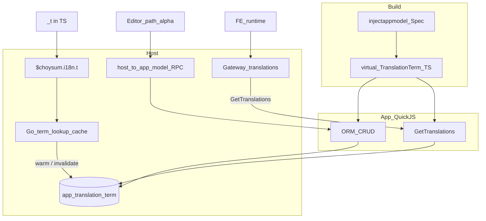

<!--
SPDX-FileCopyrightText: 2026-present Brian Wang <wangbuke@gmail.com>
SPDX-License-Identifier: LGPL-3.0-or-later
-->

# 术语 i18n × injectappmodel 改造设计

更新时间：2026-08-06

**地位：** 相对 [terminology-i18n-design.md](./terminology-i18n-design.md) 的 **一次性改造** 规格。冲突时以本文为准；落地后回写主设计 §1 / §3 / §6 / §8 / §13（废止或改写 D5·D14·D17 及相关反模式）。

**不考虑向后兼容。** 删除面见 §8。

---

## 0. 怎么读

| 读者 | 路径 |
|---|---|
| 拍板 | §1 → §2 → §8 → §10 |
| inject / build | §3 → §4 |
| 模型 / Gateway / Editor / PO | §5 → §6 |
| BE `_t` | §7 |
| 实施 | §10 → **§12** |

**分层口诀（改造后）：**

> **表** `{app}_translation_term` ← **TS** `@Model('TranslationTerm')`（ORM CRUD + `GetTranslations`）  
> **FE 读词** ← Gateway `GET /web/i18n/translations` ← dial 各 app `GetTranslations`  
> **改译** ← 路径 α：标准模型客户端（单 app Search/Update；**无** `/web/i18n/terms`）  
> **BE `_t`** ← `$choysum.i18n.t` ← **Go 查词缓存**（写后 invalidate；非业务 RPC）  
> **PO packaged 写** ← **共享 helper**（install/CLI）；非 install dial 模型 gRPC

**仍成立：** 英文 msgid；lang / locale 分立；`_t` / `_lt`；CLI `extract` / `sync` / `status`（**按 module**）；无 `core_*` 术语表；浏览器不另开术语专用通道（改译与其它模型同一宿主→app 模型通道）。

---

## 1. 动机

### 1.1 今日痛点

| 面 | 今日 | 问题 |
|---|---|---|
| 模型 | abstract IR `I18n`（`go://i18n/<app>`） | 与 FieldDefault/AppSetting C2 双轨 |
| RPC | Go 合成 `{app}.I18n` + TermStore 服务 API | 特判装配、难 supersede |
| 改译 | Terminology Editor + `/web/i18n/terms` | 跨 app 聚合分页/排序特判 |
| 注入 | migrate ensure + `ServiceDescs` 强插 I18n | 非 build 期 injectappmodel |

### 1.2 目标

用 [`injectappmodel`](../../../internal/module/artifact/build/injectappmodel/) 为每非 `core` application 注入一份 `TranslationTerm`（claim 与 AppSetting 同级）。门禁仍是 **`entryPoints.service`**；仅 TranslationTerm 可 **`EnsureServiceEntry`** 在缺 entry 时补**虚拟**最小 service，再 inject。

| | FieldDefault / AppSetting | TranslationTerm |
|---|---|---|
| `EnsureServiceEntry` | `false`（缺则跳过） | **`true`**（缺则虚拟补齐再 inject） |
| 运行时 | QuickJS ORM | ORM + `GetTranslations` |
| 查词热路径 | — | Go 查词缓存（§7） |

---

## 2. 冻结结论

### 2.1 范围与切换

1. **一次性改完**，无双栈兼容窗。
2. **`TranslationTerm`**：per-app MetaModel；表 `{app}_translation_term`；无 `core.TranslationTerm`。
3. **删除** Go `{app}.I18n` handlers、TermStore **服务 API**、`EnsureI18nMeta`、`EnsureTranslationTermTable`、`ServiceDescs` 强制 I18n、空 app 强注册（原 D5）。
4. **删除** `/web/i18n/terms` 整端点与跨 app Search/Update 聚合；**不做**跨 app「统一术语列表」。
5. **保留** `GET /web/i18n/translations`：dial 各 app **模型** `GetTranslations`（QuickJS），非专用 JS 桥。
6. **BE `_t`**：Go 查词缓存 + TS 做 CRUD / `GetTranslations`。

### 2.2 injectappmodel

7. **门禁** = 最终须有 `entryPoints.service`（否则跳过 esbuild / C2）。
8. Spec **只**增 `EnsureServiceEntry`（TranslationTerm=`true`）。**否决** `RequireApplicationEntry` / `CreateMissingEntry` / `ForceInject`。
9. **Ensure 不污染源码**：不改 `package.json`、不落盘真实 `service/`；仅本轮虚拟 Effects。Ensure 后同轮 FieldDefault/AppSetting **立即**可见非空 entry。
10. **claim 固定语义**（删 Spec `ForeignClaimOnOwnerReinject`）：owner reinject 时 `NeedInject`；外键持有 process claim 则 **不** 设 `ScheduledApp`、**不** `ReleaseClaim`。FieldDefault / AppSetting / TranslationTerm **共用**同一 helper。

### 2.3 Editor / PO / ACL / 缓存

11. **Editor 路径 α**：单 application、标准模型 Search/Update。**P3 删**旧页 + `terms_api`；**P4 新建**薄页。禁止 β（薄 Gateway 聚合）与就地打补丁。
12. **`terminology.editor`**：角色保留；删旧 `{app}.I18n/*` allows；P4 绑 TranslationTerm Search/Read/Update（必要时 Create）。`GetTranslations` 不绑该角色。
13. **PO/POT 按 module**（`modules/<module>/i18n/`）。禁止「按 app 下 PO」产品语义；导出须 `module=` 或删除旧 `/web/i18n/po?application=` 行为。
14. **Packaged 写** = **共享写表 helper**（唯一 upsert/purge/invalidate）。install/CLI 只调 helper；**第一期不** dial 模型 gRPC。TS `ImportPackaged` 门面可 P6 后置。
15. **Gateway translations 进程内聚合缓存：不做**（§6.4）。沿用 `hash` / `ETag` / `unchanged`。

---

## 3. injectappmodel

### 3.1 Spec

```text
EnsureServiceEntry: bool   // TranslationTerm=true；其余 false/省略
```

| Spec | 缺 `entryPoints.service` |
|---|---|
| FieldDefault / AppSetting | 跳过 |
| TranslationTerm | 虚拟补最小 service → inject |

### 3.2 Decide / claim

- 跳过 `core`、空 application。
- 每 application 至多一份虚拟模型；三家共用 decide/claim。
- **owner reinject 不抢外键 claim**（§2.10）：
  1. DB owner → rebuild 必须 `NeedInject`（源不在盘）。
  2. 仅本模块持有/新获 claim 时设 `ScheduledApp`（结束 `ReleaseClaim`）。
  3. claim 在他人手中 → 仍 `NeedInject`，`ScheduledApp == ""`。
- 已有 `ServiceEntryPoint` → 可 NeedInject。
- 无 entry 且 `EnsureServiceEntry` → NeedInject + **NeedEnsureServiceEntry**；否则跳过。

### 3.3 与 backend build（含 `web`）

`modules/web` 仅有 `entryPoints.web`；application=`web` 仅此模块。无 service 时 builder 仍进管线，但 esbuild/C2 跳过——靠 Ensure 打破：

```text
Decide(TranslationTerm) → Ensure 虚拟 service（若需）
  → 本轮 entryPoint 非空
  → prebuild/esbuild + FieldDefault/AppSetting Decide
  → Materialize TranslationTerm + Imports
```

冷 build 每次从磁盘「无 service」出发再 Ensure，与其它虚拟 inject 一致。

### 3.4 Materialize / Effects

- Ensure：虚拟 `service/index.ts` + 本轮登记 entry；**禁止**改 `package.json`。
- Inject：`service/models/__generated__/translation_term.ts` + Imports。
- 手写模型可 Supersede 虚拟件。
- 失败：未 apply 则 `ClearAllInjectPaths`；Ensure 失败不得半套 entry。

### 3.5 Bundle

按非 core app claim 宿主；`EnsureServiceEntry` 仅作用于被选模块。

---

## 4. 目标拓扑



---

## 5. TranslationTerm 模型

### 5.1 存储

- 非 `core`；Ensure 补齐 service 后才有表/RPC。
- 表由模型 `autoMigrate` 创建。
- 键：`(Module, Lang, Scope, Src, Kind)`；`Source` = `packaged` | `override`；`Value` = msgstr。
- `Module=core` 的框架词仍 **hosted in each host app 表**（Scheme A；无 `core_translation_term`）。

### 5.2 方法

| 方法 | 实现 | 调用方 |
|---|---|---|
| `GetTranslations` | TS gRPC | Gateway translations |
| Search / Read / Create / Update / … | TS ORM | Editor α、工具 |
| `ImportPackaged`（可选门面） | TS → 共享 helper | 管理/重导；**非** install 第一期路径 |

Packaged 写入权威：**共享 helper**（§2.14）。禁止再走 TermStore 服务 API。

### 5.3 权限

- `GetTranslations`：仅宿主内部 dial。
- 写方法：标准 ACL；`terminology.editor` 见 §2.12。

### 5.4 不做

- 跨 app Gateway Search；`/web/i18n/terms`；abstract-only `I18n` 主存储面。
- 对非 `EnsureServiceEntry` Spec 自动补 service entry。

---

## 6. Gateway · Editor · PO

### 6.1 translations

```text
Browser → GET /web/i18n/translations → dial {app}.TranslationTerm.GetTranslations
```

保留 termHash / catalogHash / `unchanged` / ETag。每次请求仍可 fan-out 全 app（**无** Gateway memo）。

### 6.2 Editor（路径 α）

- 必选一个已有 TranslationTerm 宿主的 application。
- 宿主→app 模型通道：`search` / `update`；Save 后 `reloadTerminology` → translations GET。
- 取消「空 application + q」跨 app 搜索。
- **P3 删旧实现；P4 新建薄页 + ACL。**

### 6.3 PO / POT

- 磁盘与 CLI：**按 module**。
- HTTP 导出：改为强制 `module=`，或删除「按 application 打包」的旧语义。
- Editor Download（若有）：按所选 module。
- 写路径：共享 helper（§2.14）。

### 6.4 translations 缓存：不做聚合 memo

| 已有 | 缺口 |
|---|---|
| `?hash=` → `unchanged`；ETag / 304；`Cache-Control: private, no-cache` | 仍先 fan-out 才算 catalogHash |
| dial `hash: ""` | app 侧 `unchanged` 未用上 |
| App 查词缓存（`_t`） | 与 Gateway HTTP 无关 |

主设计 D10（ETag）已满足。**本改造不做** Gateway `lang → messages` memo。远期若需性能：另立项；低成本第一步可为 dial 下传 per-app hash（仍非 memo）。

---

## 7. BE `_t` 与查词缓存

| 路径 | 权威 | 缓存 |
|---|---|---|
| `_t` → `$choysum.i18n.t` | Go 查词缓存 | 保留；写后 invalidate |
| `GetTranslations` | TS | app 内 DB+hash；无 Gateway memo |
| ORM / helper 写 | TS 或共享 helper | invalidate + FE reload |

- **删：** TermStore 业务 RPC；保留可裁成 Lookup cache 的最小实现。
- **禁：** `_t` 热路径无缓存直打 ORM / async JS。
- **契约：** 任何 packaged/override 写成功后必须 invalidate；否则 `_t` 与表不一致。

---

## 8. 删除与废止

| 项 | 说明 |
|---|---|
| Go `internal/i18n/service` 业务 handlers | `{app}.I18n` |
| TermStore **服务 API** | 可裁为 Lookup cache |
| `EnsureI18nMeta` / `go://i18n/<app>` | abstract IR |
| `EnsureTranslationTermTable` | 模型 migrate |
| `ServiceDescs` 强制 I18n | 模型暴露 |
| 原 D5 空 app 强注册 | 无宿主则无；Ensure 仅 TranslationTerm |
| `/web/i18n/terms` + `terms_api` + 旧 Editor | P3 |
| 「按 app 下 PO」 | 改按 module |
| `RequireApplicationEntry` / `CreateMissingEntry` | → `EnsureServiceEntry` |
| `ForeignClaimOnOwnerReinject` | → 固定 claim 语义 |
| Gateway translations 聚合 memo | **不做** |
| 主设计 D14 / D17 原表述 | 回写：TranslationTerm MetaModel；业务 RPC 在 TS；`_t` 缓存在 Go |
| 主设计反模式「禁模型 CRUD 改译」等 | 路径 α 允许 |

CLI `extract` / `sync` / `status` 仍可 Go（开发期；按 module）。

---

## 9. 与主设计的关系

落地时更新 [terminology-i18n-design.md](./terminology-i18n-design.md)：§1 / §3 / §6 / §8 / §11 / §13 / §14。主设计文首与 D5·D14·D17 / §14 已有 **改造批注（P0）**；完整回写在 **P6**。主文档更新后互链：现行拓扑以主文档为准，本文归档为改造决策。

---

## 10. 分期（行为一次切换；PR 可拆）

| | 内容 | §12 |
|---|---|---|
| P0 | 本文；主设计冲突条款修订草案 | PR-P0 |
| P1 | `EnsureServiceEntry`；删 `ForeignClaimOnOwnerReinject`；三家共用 claim | PR-P1 |
| P2 | `TranslationTerm` Spec + 虚拟 Ensure/Inject（含 `web`）+ 单测 | PR-P2 |
| P3 | Gateway dial 模型 `GetTranslations`；删 terms + 旧 Editor + `terms_api` | PR-P3 |
| P4 | 新建 Editor α；PO 导出按 module；`terminology.editor` ACL | PR-P4 |
| P5 | 删 Go I18n / Ensure*；TermStore → Lookup；invalidate；**共享 PO helper** | PR-P5a / PR-P5b |
| P6 | 可选 `ImportPackaged` 门面；测试与 i18n CI 清理；主设计 §14 回写 | PR-P6 |

细粒度文件 / 函数 / 测试 / DoD → **§12**。

---

## 11. 本文范围外

- Gateway catalog memo；dial 下传 per-app hash（未立项）。
- 每 app TranslationTerm **菜单**（α 薄页可先不挂标准菜单）。
- 多实例 Gateway 缓存策略（因不做 memo，不适用）。

---

## 12. 开发任务清单（按 PR / 文件 / 函数 / 测试粒度）

体例同 [terminology-i18n-design.md §14](./terminology-i18n-design.md)：**PR → 建议标题 → 文件/函数任务 → 测试 → DoD**。  
路径为建议位点；实现可微调命名，但不得偏离 **§2 冻结结论** 与 **§11 范围外**。

与主设计 §14 关系：本文 PR **废止/改写** 主设计中依赖 Go `{app}.I18n`、`/web/i18n/terms`、Terminology Editor-via-terms、`EnsureI18nMeta` / `EnsureTranslationTermTable`、以及「禁 TranslationTerm MetaModel / 禁模型 CRUD 改译」的任务（尤其原 S3-1 合成 I18n、S5-* terms Editor）。CLI extract/sync/status、FE translations 加载、`_t` bridge 等仍以主设计为准，除非本文明示覆盖。

### 12.0 总览

**合并顺序：** `P0` → `P1` → `P2` →（`P3` 与 `P5a` 可短窗并行，但 **P3 接线前 P2 须合入**）→ `P4`（依赖 P3）→ `P5b`（依赖 P5a；与 P4 可并行）→ `P6`。

| PR | Stage | 建议标题（conventional） | 依赖 |
|---|---|---|---|
| PR-P0 | P0 | `docs(i18n): add terminology×injectappmodel redesign` | — |
| PR-P1 | P1 | `refactor(injectappmodel): EnsureServiceEntry + unify claim semantics` | P0 |
| PR-P2 | P2 | `feat(injectappmodel): inject TranslationTerm MetaModel per app` | **P1** |
| PR-P3 | P3 | `feat(i18n-gateway): dial TranslationTerm.GetTranslations; remove terms API` | **P2** |
| PR-P4 | P4 | `feat(web): Terminology Editor via TranslationTerm model client` | **P3** |
| PR-P5a | P5 | `refactor(i18n): shared packaged-term write helper + lookup-only TermStore` | P2（表/模型面就绪） |
| PR-P5b | P5 | `refactor(i18n): remove Go I18n handlers and Ensure* meta/table` | **P3**, **P5a** |
| PR-P6 | P6 | `chore(i18n): ImportPackaged facade, CI cleanup, sync main design §14` | P4, P5b |

**本改造明确不产生任务的内容：** Gateway translations 进程内 catalog memo；`RequireApplicationEntry` / `CreateMissingEntry` / 可配置 `ForeignClaimOnOwnerReinject`；Ensure 回写 `package.json`；install 期 dial 模型 gRPC 作 PO import；薄 Gateway 跨 app terms 聚合（β）；每 app TranslationTerm 标准菜单（α 可先无菜单）；`core.TranslationTerm` / `core_translation_term`；双栈兼容窗。

---

### 12.1 建议路径地图（文件级）

| 区域 | 建议路径 | 职责 |
|---|---|---|
| Spec / claim | `internal/module/artifact/build/injectappmodel/spec.go`、`inject.go`、`registry.go` | `EnsureServiceEntry`；删 `ForeignClaimOnOwnerReinject`；统一 `claimNeedInject` |
| Session / Effects | `injectappmodel/session.go`、`effects.go`、`source.go` | Ensure 虚拟 service entry；Materialize TranslationTerm |
| Bundle / backend 接线 | `injectappmodel/bundle.go`；`internal/module/artifact/build/backend/`（apply Effects） | 同轮 Ensure→entry→C2；`web` 无盘上 service |
| 虚拟模型源 | inject 生成的 `…/__generated__/translation_term.ts`（虚拟） | `@Model('TranslationTerm')` + ORM + `GetTranslations` |
| Gateway translations | `internal/i18n/gateway/client.go`、`translations.go` | dial `{app}.TranslationTerm/GetTranslations`（替代 `{app}.I18n`） |
| Gateway terms / PO | `gateway/terms.go`、`terms_client.go`、`po_export.go`、`gateway.go` | **删** terms 路由；PO 改强制 `module=` 或删旧 app 语义 |
| FE terms 客户端 | `modules/web/web/stores/i18nStore/terms_api.ts`（删） | 随 P3 删除 |
| Editor | `modules/web/web/pages/TerminologyEditor.vue`；`modules/base/web/route/routes.ts`、`menu/menus.ts` | P3 拆旧；P4 新建 α |
| ACL 种子 | `modules/auth/data/bootstrap.json`；`internal/i18n/models/i18n_meta.go`（删 seed） | 改绑 TranslationTerm；删 I18n method allows |
| PO helper | `internal/i18n/import/`（收口） | 唯一 packaged 写；invalidate |
| Lookup cache | `internal/i18n/store/`、`internal/i18n/bridge/` | 裁掉服务 API；保留 `_t` Lookup |
| Go I18n 删除 | `internal/i18n/service/`；注册面（ApplicationService / ServiceDescs） | 删 handlers / 强制 append |
| Ensure 删除 | `internal/i18n/models/i18n_meta.go`、`translation_term.go` ensure；`evolution/schema/migrator.go` | 改由模型 migrate |
| 主设计回写 | `terminology-i18n-design.md` | D5/D14/D17、§8、§14 与本文对齐 |

---

### 12.2 PR-P0：设计文档合入

目标：改造规格进库；主设计冲突条款有可审草案（可同 PR 或紧随 docs PR）。

建议标题：`docs(i18n): add terminology×injectappmodel redesign`

改造清单（函数级）：

1. 文件：`.dev/docs/infra/i18n/terminology-i18n-injectappmodel-design.md`（本文）
2. 任务：主设计文首或 §1 增加互链：「改造中冲突以 injectappmodel 设计为准」
3. 任务（可草稿）：主设计 §1.3 / §13 D5·D14·D17 / §14 废止项批注（完整回写可留 P6）

测试清单：无（文档）。

完成定义（DoD）：

1. §2 冻结结论完整；§12 任务清单可指导实现。
2. 评审者能从本文判断与主设计 §14 S3/S5 的取代关系。

---

### 12.3 PR-P1：EnsureServiceEntry + 统一 claim

目标：Spec 增 `EnsureServiceEntry`；**删除** `ForeignClaimOnOwnerReinject`；FieldDefault/AppSetting/（预留）共用「reinject 不抢外键 claim」；**尚不**注册 TranslationTerm。

建议标题：`refactor(injectappmodel): EnsureServiceEntry + unify claim semantics`

改造清单（函数级）：

1. 文件：`internal/module/artifact/build/injectappmodel/spec.go`
2. 任务：增加 `EnsureServiceEntry bool`；**删除** `ForeignClaimOnOwnerReinject`
3. 文件：`registry.go` → `DefaultSpecs()`
4. 任务：AppSetting / FieldDefault 均 `EnsureServiceEntry: false`；去掉 AppSetting 上旧 flag
5. 文件：`inject.go` → `claimNeedInject` / `decidePlan`
6. 任务：一律走「外键 claim 时 NeedInject 且 ScheduledApp 空」；删除 flag 分支
7. 任务：为 `EnsureServiceEntry` 预留 Decide 分支（无 entry 时 NeedEnsure；本 PR 可仅 Spec+测试桩，或与 Materialize Ensure 同 PR——若拆开，Ensure 实现放 P2）
8. 文件：backend / Session 接线处确认释放逻辑仍只 `ReleaseClaim` 当 `ScheduledApp != ""`

测试清单：

1. 文件：`injectappmodel/injectappmodel_test.go`、`coverage_test.go`
2. 用例：FieldDefault 在外键 claim 下 reinject **不**带 ScheduledApp（与今日 AppSetting 对齐）
3. 用例：删 flag 后无编译/注册残留
4. 用例：`EnsureServiceEntry` 字段存在；FieldDefault 缺 entry 仍跳过

完成定义（DoD）：

1. 三家（现有两家）claim 语义一致；无 Spec 开关。
2. 既有 FieldDefault/AppSetting 注入行为除 claim 对齐外不变。
3. **不**改 `package.json`；**不**引入 TranslationTerm。

---

### 12.4 PR-P2：TranslationTerm inject + 虚拟模型

目标：注册 TranslationTerm Spec（`EnsureServiceEntry: true`）；虚拟 Ensure service + 生成模型；`GetTranslations` 在 TS；表由模型 migrate；`web` app 经 Ensure 获得宿主。

建议标题：`feat(injectappmodel): inject TranslationTerm MetaModel per app`

改造清单（函数级）：

1. 文件：`injectappmodel/registry.go` → `DefaultSpecs()`
2. 任务：增加 TranslationTerm Spec（GeneratedRelPath、BaseModel 若需要、`EnsureServiceEntry: true`、DuplicateCode）
3. 文件：`inject.go` / `source.go` / `effects.go`
4. 函数：Ensure 路径——虚拟最小 `service/index.ts`；更新本轮 `entryPoint` / 内存 `ServiceEntryPoint`；**禁止**写磁盘 `package.json`
5. 函数：Materialize——虚拟 `translation_term.ts`（字段对齐主设计键；`GetTranslations` method；ORM CRUD）
6. 任务：Decide 顺序：TranslationTerm Ensure **早于** 同轮 FieldDefault/AppSetting Decide（或 Ensure 后刷新 entry 再跑其余 Spec）
7. 文件：`backend` apply Effects / Bundle 接线
8. 任务：失败 `ClearAllInjectPaths`；半套 Ensure 不得残留
9. 任务：手写 `service/models/translation_term.ts` 可 Supersede
10. 任务：**不**调用 `EnsureTranslationTermTable`（表随模型 autoMigrate）；本 PR 可暂双轨表 ensure，但 P5b 必须删——优先本 PR 起靠模型 migrate

测试清单：

1. 文件：`injectappmodel/*_test.go`（扩）
2. 用例：application=`web`、模块无 service → Ensure 后 esbuild/inject 成功；磁盘 `package.json` 未改
3. 用例：同 app 多模块仅一份 TranslationTerm；sibling 不二次 inject
4. 用例：owner reinject + 外键 claim 行为符合 §2.10
5. 用例：生成模型含 `GetTranslations`；安装后存在 `{app}_translation_term`（非 core）
6. 集成：`./choysum test typecheck` 相关模块或 inject 单测覆盖生成源类型

完成定义（DoD）：

1. 非 core、经 claim 的 app（含 `web`）有 TranslationTerm 模型与表。
2. Ensure 不污染源码树。
3. 尚未删除 Go `{app}.I18n`（P5b）；Gateway 可仍 dial 旧 I18n，直到 P3。

---

### 12.5 PR-P3：Gateway dial 模型 GetTranslations；删除 terms

目标：translations 改 dial `{app}.TranslationTerm/GetTranslations`；**删除** `/web/i18n/terms` 与旧 Editor/`terms_api`；保留 translations 的 hash/ETag/unchanged。

建议标题：`feat(i18n-gateway): dial TranslationTerm.GetTranslations; remove terms API`

改造清单（函数级）：

1. 文件：`internal/i18n/gateway/client.go` → `fetchAppTranslations`
2. 任务：Dial/FullMethod 改为 TranslationTerm `GetTranslations`；请求/响应 map 字段对齐 TS 模型（保持对外 HTTP JSON 契约）
3. 文件：`translations.go`——行为保持 fan-out；**不**加进程内 memo；dial `hash` 仍可先 `""`（下传优化不在本期）
4. 文件：`gateway.go` → `RegisterHandlers`
5. 任务：**注销** terms 路由；保留 `translations`；`po` 路由本 PR 可暂留，语义修正放 P4
6. 删除：`terms.go`、`terms_client.go`、相关 auth_forward 仅 terms 使用的路径（若 translations 仍需 internal dial 则保留）
7. 文件：`modules/web/web/stores/i18nStore/terms_api.ts`（删）及 `index.ts` 导出
8. 文件：`modules/web/web/pages/TerminologyEditor.vue`——**删除或打成不可达**（路由/菜单一并摘掉）
9. 文件：`modules/base/web/route/routes.ts`、`menu/menus.ts`——移除 Terminology Editor 入口（P4 再挂）
10. 删除/改写：`gateway_terms_test.go`、`terms_client_test.go`、FE `terms_api.test.ts`

测试清单：

1. 文件：`gateway_test.go`（扩）——translations 经假 TranslationTerm dial 成功；hash/unchanged/ETag 仍绿
2. 用例：`GET|PATCH /web/i18n/terms` → 404
3. 用例：无 Editor 路由或访问被挡
4. 回归：FE `terminology_loader` / i18nStore 拉 translations 仍成功（需环境有 P2 模型）

完成定义（DoD）：

1. 浏览器读词只经 translations → 模型 GetTranslations。
2. terms HTTP 与旧 Editor 客户端路径为零。
3. **不做** Gateway catalog memo。

---

### 12.6 PR-P4：Editor 路径 α + PO 按 module + ACL

目标：新建单 app Editor（模型客户端）；PO 导出强制 module；`terminology.editor` 改绑 TranslationTerm。

建议标题：`feat(web): Terminology Editor via TranslationTerm model client`

改造清单（函数级）：

1. 文件：`modules/web/web/pages/TerminologyEditor.vue`（**新建**，非旧文件打补丁）
2. 任务：强制选 application；`createStoreByModel` / 等价调用 Search/Update；无跨 app q 聚合
3. 任务：Save → `reloadTerminology()` → translations GET
4. 文件：`modules/base/web/route/routes.ts`、`menu/menus.ts`——恢复入口，`defaultRoles: ['terminology.editor']`
5. 文件：`modules/auth/data/bootstrap.json`
6. 任务：删除 `auth.I18n/SearchTerms|UpdateTerm` 等 RoleMethodAccess；新增 TranslationTerm Search/Read/Update（必要时 Create）allows（按模型/方法约定，避免每 app 硬编码 I18n serviceRef）
7. 文件：`internal/i18n/gateway/po_export.go` → `servePO`
8. 任务：`module` **必填**；按 module 过滤；filename 体现 module；或删除「仅 application」导出路径
9. 文件：`po_export_test.go`、Editor 单测 / 组件测
10. 任务：Download PO（若保留）走强制 module 的 API

测试清单：

1. 用例：未选 application 不能搜全站；选 app 后 Search 分页正常
2. 用例：Update 后 translations reload hash 变
3. 用例：无 `terminology.editor` 时写失败；有角色可写
4. 用例：`GET /web/i18n/po` 无 module → 4xx；有 module → 附件
5. 用例：bootstrap 无残留 I18n serviceRef allows

完成定义（DoD）：

1. 路径 α 可用；无 terms HTTP。
2. PO 产品语义按 module。
3. ACL 与 §2.12 一致；`GetTranslations` 未绑给 editor 角色。

---

### 12.7 PR-P5a：共享 PO helper + Lookup-only TermStore

目标：**唯一** packaged 写入口；install/CLI 调 helper；TermStore 仅 Lookup/warm/invalidate/termHash；**不**经 TermStore 服务 API 写业务 RPC。

建议标题：`refactor(i18n): shared packaged-term write helper + lookup-only TermStore`

改造清单（函数级）：

1. 文件：`internal/i18n/import/import.go`（收口为共享 helper 或抽 `internal/i18n/packaged/`）
2. 函数：`UpsertPackagedTerms` / `DeleteModuleTerms`——upsert、跳过 override、purge retired kinds、invalidate、bump termHash
3. 文件：`internal/module/lifecycle/i18n.go`——继续调 helper；**不** dial gRPC
4. 文件：`internal/i18n/store/`——删除/停用作为 Search/Update 服务后端的 API；保留 Lookup 供 bridge
5. 任务：写路径统一调用 invalidate（CRUD 侧可暂 hook，完整 TS invalidate 可与 P5b/P6 衔接）
6. 任务：**不**实现 install→ImportPackaged gRPC

测试清单：

1. 文件：`import/*_test.go`、`lifecycle/i18n_test.go`
2. 用例：override 不被 packaged 覆盖；invalidate 后 `_t` 见新值
3. 用例：core PO fan-out 入各 host 表 `Module=core` 仍成立
4. 用例：无第二套写语义（测试禁止旁路直接乱插不同规则）

完成定义（DoD）：

1. packaged 写只有 helper 一条语义。
2. `_t` 仍走 Go Lookup cache。

---

### 12.8 PR-P5b：删除 Go I18n / Ensure*

目标：拆除 Go `{app}.I18n`、EnsureI18nMeta、EnsureTranslationTermTable、ServiceDescs 强制 I18n；注册面只留模型暴露的服务。

建议标题：`refactor(i18n): remove Go I18n handlers and Ensure* meta/table`

改造清单（函数级）：

1. 删除或掏空：`internal/i18n/service/` 业务 handlers（GetTranslations/SearchTerms/UpdateTerm）
2. 文件：ApplicationService / bootstrap `ServiceDescs` 等——去掉强制 append `{app}.I18n`
3. 文件：`internal/i18n/models/i18n_meta.go`——删除 `EnsureI18nMeta` 及 terminology editor I18n seed
4. 文件：`internal/module/evolution/schema/migrator.go`——去掉 EnsureI18nMeta / EnsureTranslationTermTable 调用
5. 文件：`internal/i18n/models/translation_term.go`——删除 `EnsureTranslationTermTable`（表仅模型 migrate）
6. 文件：grpcauth 白名单等——`*.I18n/GetTranslations` 改为模型方法名或宿主-only 策略对齐
7. 删除过时测试：`i18n_meta_test.go`、service 注册测中的 I18n 断言等

测试清单：

1. 用例：新装 app **无** `go://i18n/<app>` MetaModel；有 TranslationTerm 声明
2. 用例：无 `{app}.I18n` ServiceDesc；translations Gateway 仍绿
3. 用例：migrator 不再 create 抽象 I18n
4. 全量：`go test` 相关包；模块 typecheck

完成定义（DoD）：

1. §8 删除清单中 Go I18n / Ensure* 项清零。
2. 运行时读词 / 改译 / `_t` 不依赖已删 API。

---

### 12.9 PR-P6：门面、CI、主设计回写

目标：可选 TS `ImportPackaged` 调共享 helper；清理 CI/i18n 测试；主设计与本文互链并改写 §14。

建议标题：`chore(i18n): ImportPackaged facade, CI cleanup, sync main design §14`

改造清单（函数级）：

1. 任务（可选）：TranslationTerm 上 `ImportPackaged` → bridge/helper；**非** install 默认路径
2. 文件：i18n 相关 CI / pot 漂移测——适配新模型与删 terms
3. 文件：`terminology-i18n-design.md`——D5/D14/D17、§3 拓扑、§6 存储、§8 Gateway/Editor α、§14 废止 S3-1 合成 I18n 与 S5 terms 任务并指向本文 §12
4. 任务：TS Update/Import 成功路径确认 invalidate（§7.3）

测试清单：

1. 用例（若做门面）：ImportPackaged 与 helper 语义一致
2. CI 绿；主设计与本文无冲突表述

完成定义（DoD）：

1. 主设计声明：现行拓扑以主文档为准，本文为已执行改造决策归档。
2. §11 范围外项仍未误做成任务。

---

### 12.10 依赖与并行

1. **阻塞线：** P0 → P1 → P2 → P3 → P4；P2 → P5a → P5b；P3 与 P5b 均须在「删 Go I18n」前保证 Gateway 已切模型。
2. **可并行：** P4 ∥ P5a/P5b（P5b 须 P3）；P6 最后。
3. **行为一次切换：** 对外可感知切换尽量落在 P3（读）+ P5b（删旧写栈）窗口；避免长期双 I18n。
4. 每个 PR 保持可回滚（未接线或 feature 边界清晰）。

---

### 12.11 每个 PR 的 Reviewer 检查项

1. 是否回写模块 `package.json` `entryPoints.service` 或往源码树落真实 Ensure 文件？→ **必须否**。  
2. 是否重新引入 `RequireApplicationEntry` / `CreateMissingEntry` / 可配置 `ForeignClaimOnOwnerReinject`？→ **必须否**。  
3. FieldDefault 与 AppSetting claim 是否仍分叉？→ **必须否**（统一不抢外键 claim）。  
4. 是否新增 `/web/i18n/terms` 或薄 Gateway 跨 app Search？→ **必须否**。  
5. 是否实现 Gateway translations 进程内 catalog memo？→ **必须否**（§2.15）。  
6. translations 是否仍 dial Go `{app}.I18n`（P3 之后）？→ **必须否**（须 TranslationTerm）。  
7. Editor 是否就地保留跨 app `q` UX 或继续调 `terms_api`？→ **必须否**（α）。  
8. PO 导出是否仍「仅 application、整 app 打包」当产品语义？→ **必须否**（按 module）。  
9. install PO 是否 dial 模型 gRPC？→ **必须否**（共享 helper）。  
10. packaged 写是否出现第二套 upsert 规则？→ **必须否**。  
11. `_t` 热路径是否改打 ORM / async JS？→ **必须否**（Go Lookup）。  
12. 是否创建 `core.TranslationTerm` / `core_translation_term`？→ **必须否**。  
13. `GetTranslations` 是否绑给 `terminology.editor` 或对浏览器 Public 化 app 方法？→ **必须否**。  
14. P5b 之后是否仍调用 `EnsureI18nMeta` / `EnsureTranslationTermTable`？→ **必须否**。  
15. 是否为双栈兼容长期保留 Go I18n handlers？→ **必须否**（一次性删除）。  
16. Editor 写 ACL 是否仍指向 `*.I18n/SearchTerms|UpdateTerm`？→ **必须否**（TranslationTerm 模型方法）。  
17. 主设计 §14 回写后是否仍要求「术语写必须经 `/web/i18n/terms`」？→ **必须否**（改 α / 模型通道）。
